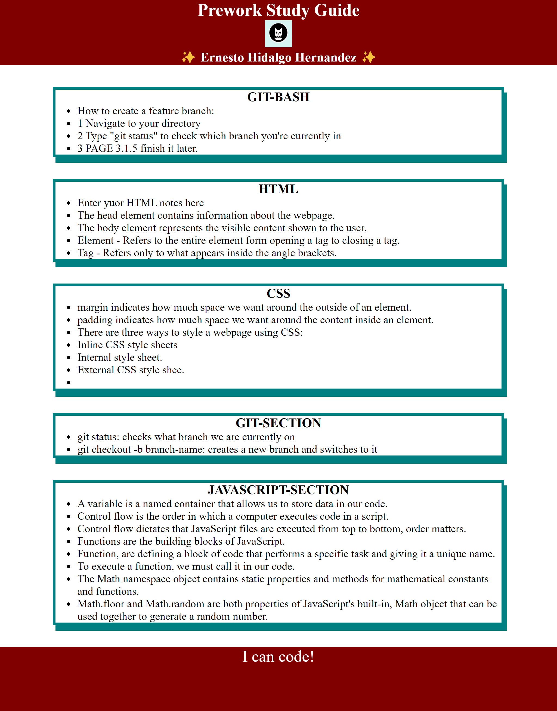

# Study Guide Webpage

## Description

This study guide was created for boot camp students who are going through the Prework phase.
 It contains notes on HTML, CSS, Git, and JavaScript, providing essential information to help students prepare for the boot camp basics.

- What was your motivation?
 I have been built to address a specific needS to fulfill a goal, having a better structure and providing a study guide for me, going through Prework.
- Why did you build this project? 
To upport my education and learning by providing comprehensive notes and resources on HTML, CSS, Git, and JavaScript.
- What problem does it solve? 
The project solves the problem to many students needing structured and detailed resources to study and prepare for any topic. Helping students understand key concepts and prepare effectively for the boot camp.
- What did you learn? 
Through building the project, I have learned valuable skills in content organization, Markdown formatting, and version control.
Researching and compiling notes on HTML, CSS, Git, and JavaScript.I would have deepened the understanding of these topics, enhancing my knowledge and proficiency in web development. 
And much more.

## Table of Contents 

The study guide includes the following sections:

- HTML Notes: Detailed notes on HTML markup, elements, attributes, semantic HTML, and accessibility.
- CSS Notes: Comprehensive coverage of CSS selectors, properties, layout techniques, responsive design, and CSS frameworks.
- Git Notes: Essential information on Git version control, including basic commands, branching strategies, merging, and working with remote repositories.
- JavaScript Notes: In-depth coverage of JavaScript fundamentals, including data types, variables, operators, functions, control flow.

## Usage

To use this study guide, simply clone or download the repository to your local machine. You can then access the study guide notes in Markdown format and customize them as needed. You can use these notes as a reference while going through the Prework phase of the boot camp or as supplementary material.

To add a screenshot, create an `assets/images` folder in your repository and upload your screenshot to it. Then, using the relative file path, add it to your README using the following syntax:

## Credits

N/A

## License

The last section of a high-quality README file is the license. This lets other developers know what they can and cannot do with your project. If you need help choosing a license, refer to [https://choosealicense.com/](https://choosealicense.com/).

---

🏆 The previous sections are the bare minimum, and your project will ultimately determine the content of this document. You might also want to consider adding the following sections.

## Badges

Badges aren't necessary, but they demonstrate street cred. Badges let other developers know that you know what you're doing. Check out the badges hosted by [shields.io](https://shields.io/). You may not understand what they all represent now, but you will in time.

## Features

If your project has a lot of features, list them here.

## How to Contribute

If you created an application or package and would like other developers to contribute to it, you can include guidelines for how to do so. The [Contributor Covenant](https://www.contributor-covenant.org/) is an industry standard, but you can always write your own if you'd prefer.

## Tests

Go the extra mile and write tests for your application. Then provide examples on how to run them here.